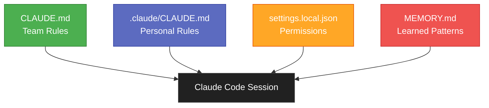
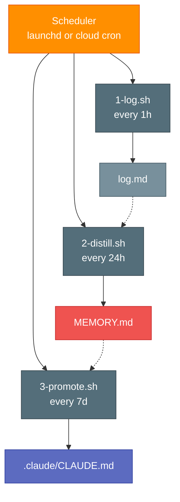

# Claude OS

A layered context and automated learning loop for Claude Code. Roll out in three phases.

## Architecture

### Phase 1: Static Context

Four files loaded into every Claude Code session automatically.



### Phase 2 and 3: Learning Loop

Data flows in a cycle: sessions produce logs, logs get distilled into patterns, patterns get promoted into rules, rules feed back into the next session.


### Automation (Phase 3)

A scheduler triggers three scripts that run headless Claude Code.



---

## Phase 1: Static Context (Start Here)

Set up the four core files that give Claude persistent context across sessions.

### Files

| File | Scope | Purpose |
|------|-------|---------|
| `/CLAUDE.md` | Team (checked into git) | Build commands, architecture, testing rules, code style |
| `/.claude/CLAUDE.md` | Personal (gitignored) | Your workflow preferences, review style, environment constraints |
| `/.claude/settings.local.json` | Personal (gitignored) | Which commands auto-approve without prompting |
| `~/.claude/projects/{project}/memory/MEMORY.md` | Personal (auto-loaded) | Learned patterns: API endpoints, architecture notes, conventions |

### Setup

1. **Team CLAUDE.md** - should already exist in your repo root. If not, create one with build commands, architecture overview, testing requirements, and code style rules.

2. **Personal CLAUDE.md** - create `/.claude/CLAUDE.md` for your own rules. Examples:
   - PR review workflow preferences
   - Comment style (no em dashes, no verdicts, etc.)
   - Environment constraints (missing CLI tools, API endpoints)
   - Behavior rules (no unsolicited edits, which config file to use for what)

3. **Settings**:`/.claude/settings.local.json` accumulates automatically as you approve tool calls. You can also edit it directly:
   ```json
   {
     "permissions": {
       "allow": [
         "Bash(git:*)",
         "Bash(make:*)",
         "Bash(curl:*)"
       ]
     }
   }
   ```

4. **Memory** - Claude writes to `MEMORY.md` as it learns about your project. Organize by topic for quick lookup. Keep under 200 lines (content beyond line 200 gets truncated in context).

### Verify

Start a new Claude Code session and ask: "What do you know about this project?" It should reference content from all four files.

---

## Phase 2: Manual Learning Loop

Add a session log and manually run distill/promote cycles to build up your memory over time.

### New File

| File | Purpose |
|------|---------|
| `~/.claude/projects/{project}/memory/log.md` | Append-only chronological session history |

### The Loop

```
After each session  →  Append entry to log.md
End of day          →  Distill log.md patterns into MEMORY.md
End of week         →  Promote stable MEMORY.md patterns to .claude/CLAUDE.md
```

### Setup

1. **Add log.md**:create `~/.claude/projects/{project}/memory/log.md`:
   ```markdown
   # Session Log

   ## YYYY-MM-DD

   - What you worked on, what you learned, what went wrong
   ```

2. **Add memory rule** to your personal `/.claude/CLAUDE.md`:
   ```markdown
   ## Memory

   - Hybrid approach: `MEMORY.md` for topical lookup, `log.md` for chronological history.
   - At the end of each session, append a dated entry to `log.md`.
   - Update `MEMORY.md` topics only when stable new patterns are confirmed.
   ```

3. **Distill (daily)**:at the end of each day, tell Claude:
   ```
   Read memory/log.md and memory/MEMORY.md.
   Distill any new patterns from today's logs into MEMORY.md.
   Do not duplicate existing entries.
   ```

4. **Promote (weekly)**:at the end of each week, tell Claude:
   ```
   Read memory/MEMORY.md and .claude/CLAUDE.md.
   If any pattern in MEMORY.md appeared 3+ times and is not yet a rule,
   add it to .claude/CLAUDE.md under the appropriate section.
   ```

### What Good Looks Like

After a few weeks, your `.claude/CLAUDE.md` should contain rules that were earned through repeated experience, not guessed upfront. Example progression:

```
log.md:    "02-18: Claude tried gh CLI, not installed"
log.md:    "02-19: Claude tried gh CLI again"
log.md:    "02-20: Claude tried gh CLI a third time"
           ↓ distill
MEMORY.md: "gh CLI is not installed, recurring friction (3x)"
           ↓ promote
CLAUDE.md: "gh CLI is NOT installed. Do not attempt to use it."
```

---

## Phase 3: Automated Learning Loop

Automate the loop so it runs without manual intervention.

### Architecture

```
Every 1 hour   →  1-log.sh    →  Append new sessions to log.md
Every 24 hours →  2-distill.sh →  Distill log.md patterns into MEMORY.md
Every 7 days   →  3-promote.sh →  Promote stable patterns to .claude/CLAUDE.md
```

Each script runs headless Claude Code (`claude -p`) to do the reading and writing.

### Option A: Local (macOS launchd)

Best for individual use. Runs when your Mac is on, catches up on missed runs after sleep.

**Install:**
```bash
# Copy scripts
mkdir -p ~/scripts/claude-memory/output
cp 1-log.sh 2-distill.sh 3-promote.sh ~/scripts/claude-memory/
chmod +x ~/scripts/claude-memory/*.sh

# Edit scripts: update PROJECT_DIR and MEMORY_DIR paths for your project

# Copy launchd plists
cp com.claude.memory-*.plist ~/Library/LaunchAgents/

# Load all three
launchctl load ~/Library/LaunchAgents/com.claude.memory-log.plist
launchctl load ~/Library/LaunchAgents/com.claude.memory-distill.plist
launchctl load ~/Library/LaunchAgents/com.claude.memory-promote.plist
```

**Verify:**
```bash
launchctl list | grep com.claude
```

**Monitor:**
```bash
cat ~/scripts/claude-memory/output/*.log
```

**Stop:**
```bash
launchctl unload ~/Library/LaunchAgents/com.claude.memory-*.plist
```

**Schedules (adjustable in plist files):**

| Agent | StartInterval | Frequency |
|-------|--------------|-----------|
| `com.claude.memory-log` | 3600 | Every 1 hour |
| `com.claude.memory-distill` | 86400 | Every 24 hours |
| `com.claude.memory-promote` | 604800 | Every 7 days |

For testing, use 3x speed: 1200 / 28800 / 198720 seconds.

### Option B: Cloud (Recommended for Teams)

Best for shared infrastructure. Runs even when individual machines are off.

**Requirements:**
- A cloud compute environment (AWS Lambda, CI pipeline, or small VM)
- Claude API key (not Claude Code CLI)
- Git access to push memory file changes

**Approach:**
Replace `claude -p` in the scripts with direct Claude API calls via a Python script:

```python
import anthropic

client = anthropic.Anthropic()

# Read memory files from git repo
# Send to Claude API with distill/promote instructions
# Commit updated files back to repo
```

**Suggested platforms:**
- **Bitbucket Pipelines**:scheduled pipelines, already in your toolchain
- **AWS Lambda + EventBridge**:serverless, pay-per-invocation
- **GitHub Actions**:cron schedules, free tier available

---

## File Tree

```
/your-repo/
├── CLAUDE.md                          ← Team rules (git tracked)
├── .claude/
│   ├── CLAUDE.md                      ← Personal rules (gitignored)
│   ├── settings.local.json            ← Permission auto-approvals (gitignored)
│   └── commands/
│       └── review.md                  ← Custom slash commands
│
~/.claude/projects/{project}/memory/
├── MEMORY.md                          ← Topical patterns (auto-loaded)
├── log.md                             ← Session history (read on demand)
└── archive/
    └── YYYY-MM.md                     ← Rolled-off old logs

~/scripts/claude-memory/               ← Automation scripts (Phase 3)
├── 1-log.sh
├── 2-distill.sh
├── 3-promote.sh
├── README.md
└── output/                            ← Script execution logs
```

---

## FAQ

**Can I lock my screen?**
Yes. launchd agents run as long as you're logged in. Lock screen does not stop them.

**What about sleep?**
launchd catches up on missed runs when the Mac wakes. No data is lost.

**How much does the automation cost?**
Each script run is capped with `--max-budget-usd`. Default: $0.05 for log, $0.10 for distill, $0.10 for promote. At production frequency: ~$2.50/week.

**What if MEMORY.md gets too long?**
Keep it under 200 lines. Lines beyond 200 are truncated when loaded into context. Archive old log entries monthly.

**Can multiple projects share the same loop?**
Each project gets its own memory directory under `~/.claude/projects/`. You'd need separate script copies (or parameterize PROJECT_DIR) per project.
