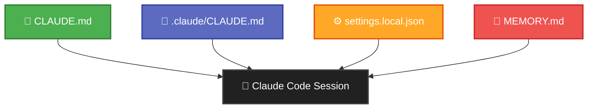
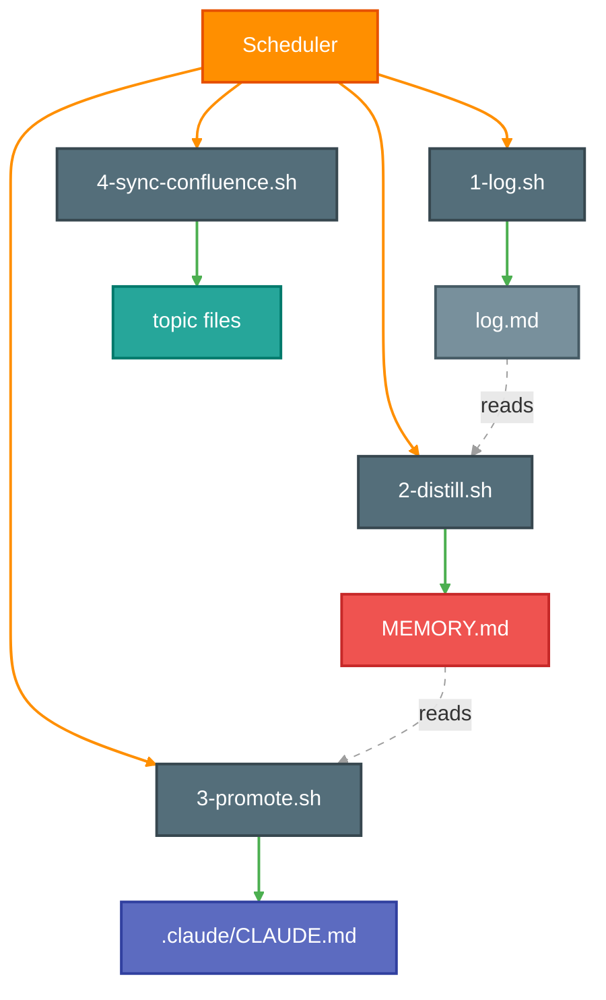

# Claude Code Memory System

An enterprise standards personalized assistant for Claude Code. A layered context and learning loop architecture. Executed in three phases, iterate on each phase.

## What Teams Are Asking

| Department | # | Without Memory System (Stock Claude) | Evals |
|------------|---|--------------------------------------|-------|
| **Engineering** | 42 | Puts validation in wrong layer (no architecture rules) / Uses CLI tools that aren't installed (no env constraints) / Ignores team test patterns and helpers (no convention memory) | Architecture compliance rate / Env constraint adherence / Test pattern accuracy |
| **Data & Analytics** | 36 | Queries tables that don't exist in our schema (no schema memory) / Uses wrong join patterns for our data model (no convention rules) / Generates tests without our fixture helpers (no test pattern memory) | Schema accuracy rate / Join pattern compliance / Fixture usage rate |
| **Product & Design** | 24 | Drafts specs in wrong format (no template rules) / References deprecated fields (no freshness from sync) / Misses team changelog conventions (no style memory) | Template compliance rate / Field accuracy / Style adherence |
| **IT & ProdOps** | 24 | Suggests unavailable tools (no env constraints) / Generates infra configs without module conventions (no pattern rules) / Doesn't reference existing runbooks (no topic file access) | Tool availability accuracy / Config convention compliance / Runbook reference rate |
| **Ad Operations** | 23 | Doesn't know our tag naming conventions (no naming rules) / References fields renamed last quarter (no freshness) / Generates reports in wrong client format (no template memory) | Naming accuracy / Field freshness / Report format compliance |
| **Sales** | 45 | Uses outdated product features in RFP responses (no freshness) / Mixes competitor terminology with ours (no brand rules) / Doesn't know current pricing or packaging (no business context) | Feature accuracy / Terminology compliance / Pricing accuracy |
| **Investment & Buying** | 31 | Uses wrong pacing formulas (no calculation rules) / Misapplies budget categories (no taxonomy memory) / Maps billing fields incorrectly (no schema memory) | Formula accuracy / Category compliance / Field mapping accuracy |
| **Integrated Planners** | 23 | Builds plans without our template structure (no template rules) / Uses industry benchmarks instead of our historicals (no data memory) / Doesn't know our vendor rate cards (no business context) | Template compliance / Benchmark accuracy / Rate card awareness |

Stock Claude Code has no team context, no org standards, no learning, and no grounding in enterprise resources. The memory system below closes these gaps, so output is personalized, standardized, and grounded from the first prompt.

---

## Architecture

### Phase 1 - Static Context

Four files loaded into every Claude Code session automatically.



### Phase 2 & 3 - Learning Loop

Session data flows through three stages: log, distill, promote.


### Automation Scripts



---

## Quick Reference

| File | Location | Purpose | Loaded | Example |
|------|----------|---------|--------|---------|
| `CLAUDE.md` | Repo root | Team rules, build commands, architecture, code style | Auto, every session | [view](EXAMPLES/CLAUDE.md) |
| `.claude/CLAUDE.md` | Repo `.claude/` (gitignored) | Personal workflow preferences, environment constraints | Auto, every session | [view](EXAMPLES/.claude/CLAUDE.md) |
| `settings.local.json` | Repo `.claude/` (gitignored) | Tool permissions and auto-approval rules | Client-side only (no tokens) | [view](EXAMPLES/.claude/settings.local.json) |
| `MEMORY.md` | `~/.claude/projects/{project}/memory/` | Learned patterns, API notes, project conventions | Auto, every session | [view](EXAMPLES/memory/MEMORY.md) |
| `log.md` | `~/.claude/projects/{project}/memory/` | Append-only chronological session history | On demand | [view](EXAMPLES/memory/log.md) |
| Topic files | `~/.claude/projects/{project}/memory/` | Reference docs: Confluence pages, API specs, runbooks | On demand | [view](EXAMPLES/memory/tips-bash-mode.md) |
| `commands/review.md` | Repo `.claude/commands/` | Custom slash commands (e.g., /review) | When invoked | [view](EXAMPLES/.claude/commands/review.md) |

---

## Phase 1: Static Context (Start Here)

Set up the four core files that give Claude persistent context across sessions.

### Files

| File | Scope | Purpose |
|------|-------|---------|
| `/CLAUDE.md` | Team (checked into git) | Build commands, architecture, testing rules, code style |
| `/.claude/CLAUDE.md` | Personal (gitignored) | Your workflow preferences, review style, environment constraints |
| `/.claude/settings.local.json` | Personal (gitignored) | Which commands auto-approve without prompting |
| `~/.claude/projects/{project}/memory/MEMORY.md` | Personal (auto-loaded) | Learned patterns: API endpoints, architecture notes, conventions |

### Setup

1. **Team CLAUDE.md** - should already exist in your repo root. If not, create one with build commands, architecture overview, testing requirements, and code style rules.

2. **Personal CLAUDE.md** - create `/.claude/CLAUDE.md` for your own rules. Examples:
   - PR review workflow preferences
   - Comment style (no em dashes, no verdicts, etc.)
   - Environment constraints (missing CLI tools, API endpoints)
   - Behavior rules (no unsolicited edits, which config file to use for what)

3. **Settings** - `/.claude/settings.local.json` accumulates automatically as you approve tool calls. You can also edit it directly:
   ```json
   {
     "permissions": {
       "allow": [
         "Bash(git:*)",
         "Bash(make:*)",
         "Bash(curl:*)"
       ]
     }
   }
   ```

4. **Memory** - Claude writes to `MEMORY.md` as it learns about your project. Organize by topic for quick lookup. Keep under 200 lines (content beyond line 200 gets truncated in context).

5. **Topic files** (optional) - Drop additional markdown files in the memory directory alongside `MEMORY.md`. These are not auto-loaded, so they cost zero tokens until Claude reads them mid-session. Use them for reference material that's too large for MEMORY.md: Confluence docs, API specs, runbooks, architecture diagrams, onboarding guides. Add one-line hints in `MEMORY.md` so Claude knows they exist and when to read them.

   Topic files can be pulled from Confluence via API (`curl` with basic auth). Each team's Confluence space requires separate access, so topic files can cross-pull from other teams' spaces when given permission. This makes it easy to build a shared knowledge base across org boundaries without duplicating docs.

### Verify

Start a new Claude Code session and ask: "What do you know about this project?" It should reference content from all four files.

---

## Phase 2: Manual Learning Loop

Add a session log and manually run distill/promote cycles to build up your memory over time. This phase fits naturally into your existing team workflow.

> **Note:** The loop below is for iteration only. You can manually write to any file at any time (log.md, MEMORY.md, .claude/CLAUDE.md, or the shared CLAUDE.md). However, it is recommended to leave the automated cadence to Phase 3 and focus here on learning the rhythm.

### Who Does What

| Action | Who | When | Target File |
|--------|-----|------|-------------|
| Log sessions | Individual developer | After each session | `log.md` (personal) |
| Distill patterns | Individual developer | End of day | `MEMORY.md` (personal) |
| Promote to personal rules | Individual developer | End of week | `.claude/CLAUDE.md` (personal, gitignored) |
| Promote to team rules | Team together | End of sprint review | `CLAUDE.md` (shared, checked into git) |

The first three steps are personal. The last step is a team activity: during sprint reviews or retros, share patterns that kept coming up across the team and collectively decide which ones belong in the shared `CLAUDE.md`.

### New File

| File | Purpose |
|------|---------|
| `~/.claude/projects/{project}/memory/log.md` | Append-only chronological session history |

### The Loop

```
After each session  →  Append entry to log.md
End of day          →  Distill log.md patterns into MEMORY.md
End of week         →  Promote stable patterns to personal .claude/CLAUDE.md
End of sprint       →  Team promotes shared patterns to CLAUDE.md (git tracked)
```

### Setup

1. **Add log.md** - create `~/.claude/projects/{project}/memory/log.md`:
   ```markdown
   # Session Log

   ## YYYY-MM-DD

   - What you worked on, what you learned, what went wrong
   ```

2. **Add memory rule** to your personal `/.claude/CLAUDE.md`:
   ```markdown
   ## Memory

   - Hybrid approach: `MEMORY.md` for topical lookup, `log.md` for chronological history.
   - At the end of each session, append a dated entry to `log.md`.
   - Update `MEMORY.md` topics only when stable new patterns are confirmed.
   ```

3. **Distill (daily)** - at the end of each day, tell Claude:
   ```
   Read memory/log.md and memory/MEMORY.md.
   Distill any new patterns from today's logs into MEMORY.md.
   Do not duplicate existing entries.
   ```

4. **Promote to personal rules (weekly)** - at the end of each week, tell Claude:
   ```
   Read memory/MEMORY.md and .claude/CLAUDE.md.
   If any pattern in MEMORY.md appeared 3+ times and is not yet a rule,
   add it to .claude/CLAUDE.md under the appropriate section.
   ```

5. **Promote to team rules (sprint review)** - during sprint reviews, share friction patterns across the team. If multiple people hit the same issue, add it to the shared `CLAUDE.md` at the repo root. Example discussion:
   ```
   "Claude keeps trying to use gh CLI, which we don't have installed."
   "Same here, three times this sprint."
   → Add to CLAUDE.md: "gh CLI is NOT installed. Do not attempt to use it."
   ```

### Tutorials: Three Engineers, Three Workflows

Each tutorial follows the same arc: start manual to learn the rhythm, set up automation, then go hands-off. You can always manually write to any file at any time.

---

#### Sarah, Backend Engineer (DSP Backend)

Sarah builds REST APIs in Python/FastAPI. She uses Claude Code to generate endpoints, debug stack traces, and write tests.

**Week 1: Manual iteration**

Monday, she asks Claude to generate a new `/api/campaigns/:id/metrics` endpoint. Claude puts validation in the controller instead of the service layer.

She logs it manually:
```
## 2026-03-03
- Generated metrics endpoint. Claude put validation in controller instead of service layer.
- Had to move validation to CampaignService.validate_metrics_params().
- Claude also tried to import from `src.utils.validators` which doesn't exist.
```

End of day, she tells Claude to distill. MEMORY.md gets:
```
## Code Patterns
- Validation logic belongs in the service layer, not controllers.
- No `src.utils.validators` module exists. Validation helpers are in each service file.
```

By Friday, the same issue came up 3 more times. She promotes to her personal rules:
```
# .claude/CLAUDE.md (personal)
## Code Patterns
- Always put validation logic in the service layer, never in controllers.
- There is no shared validators module. Each service handles its own validation.
```

**Week 2: Set up automation**

She installs the Phase 3 scripts. The log, distill, and promote cycles now run on a schedule. She stops manually logging and distilling.

**Week 3+: Hands-off**

The automation handles the loop. Claude no longer puts validation in controllers. When she notices something new mid-session (e.g., a new API pattern), she still writes it directly to MEMORY.md or .claude/CLAUDE.md on the spot. The automation and manual writes coexist.

---

#### Marcus, Frontend Engineer (Basis UI)

Marcus builds React components with TypeScript. He uses Claude Code for component scaffolding, debugging re-renders, and writing Jest tests.

**Week 1: Manual iteration**

Tuesday, he asks Claude to create a `CampaignCard` component. Claude uses `useEffect` for data fetching instead of React Query, and CSS modules instead of styled-components.

He logs it:
```
## 2026-03-04
- Generated CampaignCard. Claude used useEffect + fetch instead of React Query.
- Had to refactor to useQuery with the existing queryClient setup.
- Claude also generated CSS modules, but we use styled-components.
```

End of day, he distills to MEMORY.md:
```
## Frontend Patterns
- Data fetching uses React Query (useQuery/useMutation), not useEffect + fetch.
- Styling uses styled-components, not CSS modules.
- Query client configured in src/providers/QueryProvider.tsx.
```

At the sprint retro, he shares: "Claude keeps generating useEffect for data fetching. Anyone else?" Three others nod. The team adds to the shared CLAUDE.md:
```
# CLAUDE.md (team, git tracked)
## Frontend
- Use React Query for all data fetching. Never use useEffect + fetch.
- Use styled-components for styling. Never use CSS modules.
```

**Week 2: Set up automation**

He installs the Phase 3 scripts. Personal logging and distilling are now automatic. Team promotes still happen at sprint reviews (those stay manual and collaborative).

**Week 3+: Hands-off**

Claude now scaffolds components with React Query and styled-components every time. When a new library gets adopted (e.g., Zustand for state), Marcus writes it directly to MEMORY.md without waiting for the automation cycle.

---

#### Priya, QA Engineer

Priya writes and maintains test suites. She uses Claude Code to generate test cases, debug flaky tests, and improve coverage.

**Week 1: Manual iteration**

Wednesday, she asks Claude to generate tests for `OrderService.calculateTotal`. Claude generates 8 tests but misses the discount edge case and uses `jest.mock` instead of the team's `createMockService` helper.

She logs it:
```
## 2026-03-05
- Generated tests for calculateTotal. Missed discount edge case (negative totals).
- Claude used jest.mock() directly. We have createMockService() helper in tests/helpers.
- Had to add 2 edge case tests manually.
```

End of day, she distills:
```
## Testing Patterns
- Test helpers in tests/helpers/: createMockService(), createMockUser(), etc.
- Always test discount edge cases: zero, negative, exceeds-total scenarios.
- Use createMockService() instead of raw jest.mock() for service mocks.
```

By Friday, she promotes:
```
# .claude/CLAUDE.md (personal)
## Testing
- Use helpers from tests/helpers/ (createMockService, createMockUser) instead of raw jest.mock.
- For any calculation function, always include edge cases: zero, negative, overflow, null.
```

**Week 2: Set up automation**

She installs the Phase 3 scripts. The loop runs automatically now. She notices Claude is still missing a specific pattern (factory fixtures), so she writes it directly to .claude/CLAUDE.md without waiting for the cycle.

**Week 3+: Hands-off**

Claude now uses `createMockService`, includes edge cases, and uses the factory fixtures she added manually. The automation catches any new patterns she doesn't bother to write herself.

---

### What Good Looks Like

After a few weeks, your `.claude/CLAUDE.md` should contain rules that were earned through repeated experience, not guessed upfront. Example progression:

```
log.md:    "02-18: Claude tried gh CLI, not installed"
log.md:    "02-19: Claude tried gh CLI again"
log.md:    "02-20: Claude tried gh CLI a third time"
           ↓ distill
MEMORY.md: "gh CLI is not installed, recurring friction (3x)"
           ↓ promote
CLAUDE.md: "gh CLI is NOT installed. Do not attempt to use it."
```

---

## Phase 3: Automated Learning Loop

Automate the loop so it runs without manual intervention.

### Architecture

```
Every 1 hour   →  1-log.sh             →  Append new sessions to log.md
Every 24 hours →  2-distill.sh          →  Distill log.md patterns into MEMORY.md
Every 24 hours →  4-sync-confluence.sh  →  Re-fetch Confluence pages into topic files
Every 7 days   →  3-promote.sh          →  Promote stable patterns to .claude/CLAUDE.md
```

Scripts 1-3 run headless Claude Code (`claude -p`) to do the reading and writing. Script 4 syncs Confluence pages directly via REST API (no LLM needed).

### Confluence Sync (4-sync-confluence.sh)

Keeps topic files fresh by re-fetching registered Confluence pages every 24 hours.

**How it works:**
1. Reads a `PAGES` registry array in the script (page ID, filename, description)
2. Fetches each page via Confluence REST API with basic auth
3. Converts HTML to markdown using `html2text`, strips Confluence macro artifacts
4. Writes the result to the memory directory as a topic file
5. Logs results to `output/4-sync-confluence.log`

**To add a new page**, add a line to the `PAGES` array in `scripts/4-sync-confluence.sh`:
```bash
PAGES=(
    "1597341723|claudehub.md|ClaudeHub main page"
    "1559166979|use-case-library.md|AI dev tools use-case library"
    # Add more pages here: "page_id|filename.md|description"
)
```

**Requirements:** `CONFLUENCE_EMAIL` and `CONFLUENCE_TOKEN` environment variables set in the launchd plist (or exported in your shell for manual runs). Get an API token at https://id.atlassian.com/manage-profile/security/api-tokens.

**Cross-team access:** Topic files can pull from any Confluence space you have permission to read. To pull from another team's space, request access and add their page IDs to the registry.

### Option A: Local (macOS launchd)

Best for individual use. Runs when your Mac is on, catches up on missed runs after sleep.

**Install:**
```bash
# Clone the repo
git clone https://github.com/jameswniu/claude-os.git ~/scripts/claude-memory
cd ~/scripts/claude-memory && mkdir -p output
chmod +x scripts/*.sh

# Edit scripts: update PROJECT_DIR and MEMORY_DIR paths for your project

# Copy launchd plists
cp launchd/com.claude.memory-*.plist ~/Library/LaunchAgents/

# Load all three
launchctl load ~/Library/LaunchAgents/com.claude.memory-log.plist
launchctl load ~/Library/LaunchAgents/com.claude.memory-distill.plist
launchctl load ~/Library/LaunchAgents/com.claude.memory-promote.plist
launchctl load ~/Library/LaunchAgents/com.claude.memory-sync.plist
```

**Verify:**
```bash
launchctl list | grep com.claude
```

**Monitor:**
```bash
cat ~/scripts/claude-memory/output/*.log
```

**Stop:**
```bash
launchctl unload ~/Library/LaunchAgents/com.claude.memory-*.plist
```

**Schedules (adjustable in plist files):**

| Agent | StartInterval | Frequency |
|-------|--------------|-----------|
| `com.claude.memory-log` | 3600 | Every 1 hour |
| `com.claude.memory-distill` | 86400 | Every 24 hours |
| `com.claude.memory-sync` | 86400 | Every 24 hours |
| `com.claude.memory-promote` | 604800 | Every 7 days |

For testing, use 3x speed: 1200 / 28800 / 198720 seconds.

### Option B: Cloud (Phase 4, Subject to Approval)

Best for shared infrastructure. Runs even when individual machines are off.

**Requirements:**
- A cloud compute environment (AWS Lambda, CI pipeline, or small VM)
- Claude API key (not Claude Code CLI)
- Git access to push memory file changes

**Approach:**
Replace `claude -p` in the scripts with direct Claude API calls via a Python script:

```python
import anthropic

client = anthropic.Anthropic()

# Read memory files from git repo
# Send to Claude API with distill/promote instructions
# Commit updated files back to repo
```

**Suggested platforms:**
- **Bitbucket Pipelines** - scheduled pipelines, already in your toolchain
- **AWS Lambda + EventBridge** - serverless, pay-per-invocation
- **GitHub Actions** - cron schedules, free tier available

---

## File Tree

**Your repo (Phase 1 & 2):**
```
/your-repo/
├── CLAUDE.md                          ← Team rules (git tracked)
├── .claude/
│   ├── CLAUDE.md                      ← Personal rules (gitignored)
│   ├── settings.local.json            ← Permission auto-approvals (gitignored)
│   └── commands/
│       └── review.md                  ← Custom slash commands
│
~/.claude/projects/{project}/memory/
├── MEMORY.md                          ← Topical patterns (auto-loaded)
├── log.md                             ← Session history (on demand)
├── api-specs.md                       ← Topic file (on demand, zero tokens until read)
├── confluence-runbook.md              ← Topic file (on demand, zero tokens until read)
└── archive/
    └── YYYY-MM.md                     ← Rolled-off old logs
```

**This repo (Phase 3 automation):**
```
claude-os/
├── .github
    ├── workflows
        ├── test.yml
├── .gitignore
├── EXAMPLES
    ├── .claude
        ├── CLAUDE.md
        ├── commands
            ├── review.md
        ├── settings.local.json
    ├── CLAUDE.md
    ├── memory
        ├── MEMORY.md
        ├── claudehub.md
        ├── log.md
        ├── plugin-marketplace.md
        ├── tips-bash-mode.md
        ├── use-case-library.md
├── README.md
├── launchd
    ├── com.claude.memory-distill.plist
    ├── com.claude.memory-log.plist
    ├── com.claude.memory-promote.plist
    ├── com.claude.memory-sync.plist
├── scripts
    ├── 1-log.sh
    ├── 2-distill.sh
    ├── 3-promote.sh
    ├── 4-sync-confluence.sh
    ├── update-readme.sh
├── tests
    ├── test.sh
```

---

## FAQ

**Can I lock my screen?**
Yes. launchd agents run as long as you're logged in. Lock screen does not stop them.

**What about sleep?**
launchd catches up on missed runs when the Mac wakes. No data is lost.

**How much does the automation cost?**
Each script run is capped with `--max-budget-usd`. Default: $0.05 for log, $0.10 for distill, $0.10 for promote. The Confluence sync uses no LLM (just curl), so it's free. At production frequency: ~$2.50/week.

**What if MEMORY.md gets too long?**
Keep it under 200 lines. Lines beyond 200 are truncated when loaded into context. Archive old log entries monthly.

**Can multiple projects share the same loop?**
Each project gets its own memory directory under `~/.claude/projects/`. You'd need separate script copies (or parameterize PROJECT_DIR) per project.

**Does MEMORY.md eat tokens every message?**
Yes. It's injected into the system prompt at session start and stays in context for every request. That's why the 200-line cap matters. Topic files, by contrast, cost zero tokens until Claude reads them mid-session.

**Does settings.local.json eat tokens?**
No. It's client-side only, never sent to the LLM. It only controls which tool calls auto-approve without prompting.

**What are topic files?**
Additional markdown files in the memory directory alongside MEMORY.md. They're loaded on demand (zero tokens until read). Use them for Confluence docs, API specs, runbooks, or any reference material too large for MEMORY.md. Add one-line hints in MEMORY.md so Claude knows they exist.

**How do I add a Confluence page as a topic file?**
Add the page ID and filename to the `PAGES` array in `scripts/4-sync-confluence.sh`. The page ID is in the Confluence URL (e.g., `1597341723` from `.../pages/1597341723/ClaudeHub`). The sync script will fetch it on the next run.

**Can I pull from other teams' Confluence spaces?**
Yes, if you have read access. The sync script works with any Confluence space. Request access from the team, then add their page IDs to the registry.

**How do slash commands work with tokens?**
Command names and descriptions are indexed at session start (~2% of context window). The full command content only loads when you invoke it (e.g., `/review`). So having many commands registered costs minimal tokens.

**What's the difference between CLAUDE.md and .claude/CLAUDE.md?**
`CLAUDE.md` (repo root) is shared, checked into git, visible to the whole team. `.claude/CLAUDE.md` (gitignored) is personal, only you see it. Use the shared one for team rules, the personal one for your own preferences.
