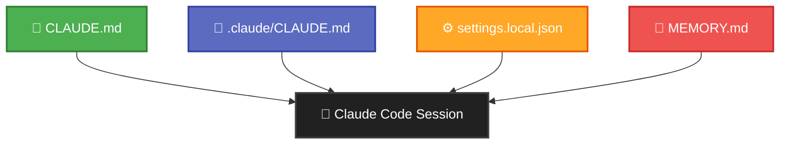
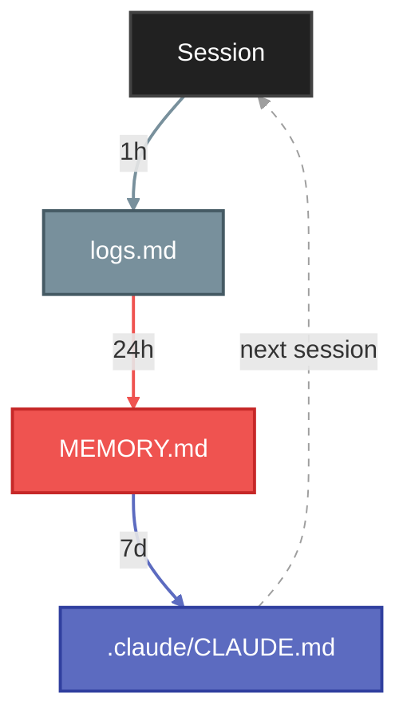
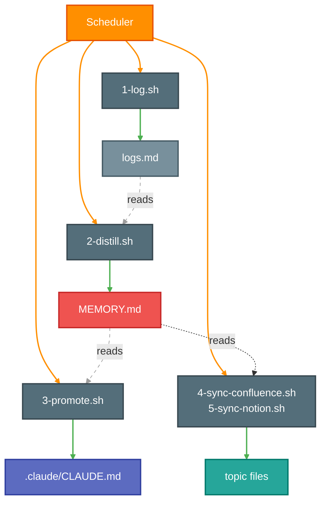

# Claude Code Memory System

An enterprise standards personalized assistant for Claude Code. A layered context and learning loop architecture. Executed in three phases, iterate on each phase.

## What Teams Are Asking

| Department | # | Top 3 Pain Points | Evals (Time Saved) |
|------------|---|-------------------|---------------------|
| **Engineering** | 42 | "Review this 20-file PR for regressions" / "Fix the failing tests in this branch" / "Refactor this service to use the new API pattern" | Review time (30-50%) / Debug-to-fix time (20-40%) / Refactoring time (25-50%) |
| **Data & Analytics** | 36 | "Debug this data pipeline failure" / "Write a query to reconcile these two datasets" / "Generate tests for this BI transformation" | Time-to-resolution (30-50%) / Query gen time (50-70%) / Test scaffolding time (50-80%) |
| **Product & Design** | 24 | "Draft acceptance criteria from this Jira epic" / "What's the blast radius of removing this field?" / "Summarize what shipped this sprint from the PR list" | First-draft time (50-70%) / Impact analysis time (40-60%) / Summarization time (70-85%) |
| **IT & ProdOps** | 24 | "Why is this deployment failing? Here are the logs" / "Generate Terraform for this new service" / "Trace this incident across these three log files" | Incident triage time (40-60%) / IaC gen time (40-60%) / Investigation time (50-75%) |
| **Ad Operations** | 23 | "Why is this campaign showing zero impressions?" / "Validate these tag configs against the spec" / "Generate a report comparing these two ad server outputs" | Troubleshooting time (30-50%) / Validation time (50-70%) / Report gen time (50-70%) |
| **Sales** | 45 | "Draft a technical response to this RFP section" / "Summarize this product update for a client meeting" / "Build a competitive comparison from these feature lists" | RFP drafting time (50-70%) / Summarization time (60-80%) / Analysis time (50-65%) |
| **Investment & Buying** | 31 | "Calculate pacing for this campaign across these channels" / "Flag any budget overages in this media plan" / "Reconcile this billing report against the insertion order" | Calculation time (50-70%) / Audit time (60-80%) / Reconciliation time (60-80%) |
| **Integrated Planners** | 23 | "Build a media plan template from this brief" / "Compare reach and frequency across these three scenarios" / "Pull performance benchmarks for this vertical" | Plan drafting time (40-60%) / Scenario analysis time (50-70%) / Research time (50-70%) |

Claude Code can do all of this out of the box. The memory system below makes it do it *consistently*, with your team's rules, patterns, and conventions baked in.

**Eval sources:** [GitHub Copilot RCT (arXiv 2302.06590)](https://arxiv.org/abs/2302.06590) | [DORA Report 2024](https://dora.dev/research/2024/dora-report/) | [Anthropic Productivity Research](https://www.anthropic.com/research/estimating-productivity-gains) | [METR Developer Productivity RCT](https://metr.org/blog/2025-07-10-early-2025-ai-experienced-os-dev-study/) | [McKinsey State of AI 2025](https://www.mckinsey.com/capabilities/quantumblack/our-insights/the-state-of-ai) | [Bidara RFP Statistics 2026](https://www.bidara.ai/research/rfp-statistics) | [Simetrik AI Reconciliation](https://simetrik.com/blog/reconciliation-maturity-a-path-to-ai-driven-excellence-for-finance-operations-teams/) | [Microsoft Azure AIOps](https://azure.microsoft.com/en-us/blog/optimizing-incident-management-with-aiops-using-the-triangle-system/) | [Tricentis AI Testing 2025](https://www.tricentis.com/blog/5-ai-trends-shaping-software-testing-in-2025) | [Capably Media Planning Automation](https://www.capably.ai/resources/media-planning-automation)

---

## Quickstart

```bash
git clone https://github.com/jameswniu/claude-os.git ~/claude-os
cd ~/your-project
bash ~/claude-os/<repo-name>/.claude/scripts/6-bootstrap.sh
```

Bootstrap auto-runs `install.sh` on first use, which sets up:
- `checkpoint` and `bootstrap` shell aliases (so next time just type `bootstrap`)
- Pre-push git hook (runs tests before every push to this repo)
- `~/.local/bin` on PATH

### Switching repos

When you `cd` into a new repo and start Claude Code:

| | Carries over? | Why |
|---|---|---|
| `~/.claude/CLAUDE.md` | Yes | Global file, loads in every project |
| `CLAUDE.md` | Yes (if in git) | Comes with the clone |
| `.claude/CLAUDE.md` | No | Gitignored, lives only in that repo |
| `.claude/settings.local.json` | No | Gitignored, lives only in that repo |
| `.claude/commands/` | No | Gitignored, lives only in that repo |
| `MEMORY.md`, `history/logs.md`, topic files | No | Stored per project path, new repo = empty |

To bootstrap a new repo with your templates:
```bash
cd ~/<new-repo>
bootstrap
```

### What's built-in vs what this repo adds

**Claude Code built-in** (official product features):

| File | Location | Behavior |
|------|----------|----------|
| `CLAUDE.md` | Repo root | Auto-loaded at session start |
| `.claude/CLAUDE.md` | Inside repo | Auto-loaded at session start |
| `.claude/settings.local.json` | Inside repo | Auto-loaded, client-side only |
| `.claude/commands/` | Inside repo | Indexed at session start |
| `~/.claude/CLAUDE.md` | Home directory | Global, auto-loaded in every project |
| `MEMORY.md` | `~/.claude/projects/{slug}/memory/` | Auto-loaded (first 200 lines) |

**This repo adds** (custom layer on top):

| Feature | What it does |
|---------|-------------|
| `history/logs.md` | Chronological session history (Claude Code only creates MEMORY.md) |
| Topic files | On-demand reference files synced from Confluence/Notion |
| Learning loop | log (1h) -> distill (24h) -> promote (7d) automation scripts |
| `checkpoint` | Filter and push live workspace files to this repo (CLAUDE.md, .claude/CLAUDE.md, MEMORY.md, topic files, history/logs.md) |
| `bootstrap` | Pull templates from this repo into a new project |

### Phase 1: Static Context

Run the init script from any project directory. It copies template files only if they don't already exist.

```bash
cd ~/<your-project>
bootstrap
```

Then edit the files for your project:
- `CLAUDE.md` - add your build commands, architecture, and test instructions
- `.claude/CLAUDE.md` - add your personal preferences (review style, behavior rules, etc.)
- `MEMORY.md` - add your project's architecture and patterns

Verify: start a new Claude Code session and ask "What do you know about this project?" Claude should reference content from CLAUDE.md and MEMORY.md.

### Phase 2: Manual Learning Loop

No setup needed. Just follow this rhythm as you work:

| When | Action |
|------|--------|
| After each session | Tell Claude: "Log what we did to logs.md" |
| End of day | Tell Claude: "Distill today's logs into MEMORY.md" |
| End of week | Tell Claude: "Promote stable patterns to .claude/CLAUDE.md" |
| End of sprint | Team promotes shared patterns to CLAUDE.md (git tracked) |

### Phase 3: Automation

Replace the manual loop with scheduled scripts.

Edit each script to update `PROJECT_DIR` and `MEMORY_DIR` paths for your project:
- `~/claude-os/<repo-name>/.claude/scripts/1-log.sh` - session logger (every 1h)
- `~/claude-os/<repo-name>/.claude/scripts/2-distill.sh` - pattern distiller (every 24h)
- `~/claude-os/<repo-name>/.claude/scripts/3-promote.sh` - rule promoter (every 7d)

Then install and verify:
```bash
cp ~/claude-os/Library/LaunchAgents/com.claude.memory-*.plist ~/Library/LaunchAgents/
launchctl load ~/Library/LaunchAgents/com.claude.memory-log.plist
launchctl load ~/Library/LaunchAgents/com.claude.memory-distill.plist
launchctl load ~/Library/LaunchAgents/com.claude.memory-promote.plist
launchctl list | grep com.claude
```

**Confluence sync (optional):**

Get an API token at https://id.atlassian.com/manage-profile/security/api-tokens and add credentials to `~/.zshrc`:
```bash
echo 'export CONFLUENCE_EMAIL="<your.email@basis.com>"' >> ~/.zshrc
echo 'export CONFLUENCE_TOKEN="<your-api-token>"' >> ~/.zshrc
source ~/.zshrc
```

Then install and run the first sync. The script auto-discovers relevant pages and adds them to MEMORY.md:
```bash
launchctl load ~/Library/LaunchAgents/com.claude.memory-sync.plist
bash ~/claude-os/<repo-name>/.claude/scripts/4-sync-confluence.sh
```

**Notion sync (optional):**

Create an internal integration at https://www.notion.so/my-integrations and add credentials to `~/.zshrc`:
```bash
echo 'export NOTION_TOKEN="<your-integration-token>"' >> ~/.zshrc
source ~/.zshrc
```

Share each Notion page with the integration (page `...` menu > "Connections" > add integration).

Then install and run the first sync. The script auto-discovers relevant pages and adds them to MEMORY.md:
```bash
launchctl load ~/Library/LaunchAgents/com.claude.memory-notion.plist
bash ~/claude-os/<repo-name>/.claude/scripts/5-sync-notion.sh
```

**Verify scripts are running:**
```bash
launchctl list | grep com.claude
```
All loaded agents should appear with a `0` exit status (second column). A `-` in the PID column (first column) means the script is not currently running, which is normal between scheduled runs.

After the first sync, the scripts run on schedule (every 24h) and automatically pick up any new `(confluence:ID)` or `(notion:ID)` entries added to MEMORY.md.

> **Deep dive:** See the Architecture and Phase sections below for how each file works and design rationale.

---

## Architecture

### Phase 1 - Static Context

Four files loaded into every Claude Code session automatically.



### Phase 2 & 3 - Learning Loop

Session data flows through three stages: log, distill, promote.



### Automation Scripts



---

## Quick Reference

| File | Location | Purpose | Loaded | Example |
|------|----------|---------|--------|---------|
| `.claude/CLAUDE.md` | Repo `.claude/` (gitignored) | Personal workflow preferences, environment constraints | Auto, every session | [view](<repo-name>/.claude/CLAUDE.md) |
| `settings.local.json` | Repo `.claude/` (gitignored) | Tool permissions and auto-approval rules | Client-side only (no tokens) | [view](<repo-name>/.claude/settings.local.json) |
| `MEMORY.md` | `~/.claude/projects/{project}/memory/` | Learned patterns, API notes, project conventions | Auto, every session | [view](.claude/projects/-Users-<user-name>-<repo-name>/memory/MEMORY.md) |
| `history/logs.md` | `~/.claude/projects/{project}/memory/` | Append-only chronological session history | On demand | [view](.claude/projects/-Users-<user-name>-<repo-name>/memory/history/logs.md) |
| Topic files | `~/.claude/projects/{project}/memory/` | Reference docs: Confluence pages, API specs, runbooks | On demand | [view](.claude/projects/-Users-<user-name>-<repo-name>/memory/) |
| `commands/review.md` | Repo `.claude/commands/` | Custom slash commands (e.g., /review) | When invoked | [view](<repo-name>/.claude/commands/review.md) |

---

## Phase 1: Static Context (Start Here)

Set up the four core files that give Claude persistent context across sessions.

### Files

| File | Scope | Purpose |
|------|-------|---------|
| `/CLAUDE.md` | Team (checked into git) | Build commands, architecture, testing rules, code style |
| `/.claude/CLAUDE.md` | Personal (gitignored) | Your workflow preferences, review style, environment constraints |
| `/.claude/settings.local.json` | Personal (gitignored) | Which commands auto-approve without prompting |
| `~/.claude/projects/{project}/memory/MEMORY.md` | Personal (auto-loaded) | Learned patterns: API endpoints, architecture notes, conventions |

### Setup

1. **Team CLAUDE.md** -  should already exist in your repo root. If not, create one with build commands, architecture overview, testing requirements, and code style rules.

2. **Personal CLAUDE.md** -  create `/.claude/CLAUDE.md` for your own rules. Examples:
   - PR review workflow preferences
   - Comment style (no em dashes, no verdicts, etc.)
   - Environment constraints (missing CLI tools, API endpoints)
   - Behavior rules (no unsolicited edits, which config file to use for what)

3. **Settings** -  `/.claude/settings.local.json` accumulates automatically as you approve tool calls. You can also edit it directly:
   ```json
   {
     "permissions": {
       "allow": [
         "Bash(git:*)",
         "Bash(make:*)",
         "Bash(curl:*)"
       ]
     }
   }
   ```

4. **Memory** -  Claude writes to `MEMORY.md` as it learns about your project. Organize by topic for quick lookup. Keep under 200 lines (content beyond line 200 gets truncated in context).

5. **Topic files** (optional) - Drop markdown files in the memory directory for reference material too large for MEMORY.md: Confluence docs, API specs, runbooks, architecture diagrams, onboarding guides. These are not auto-loaded, so they cost zero tokens until Claude reads them mid-session. Add one-line hints in `MEMORY.md` pointing to `filename.md` so Claude knows they exist and when to read them.

   Topic files can be pulled from Confluence via API (`curl` with basic auth). Each team's Confluence space requires separate access, so topic files can cross-pull from other teams' spaces when given permission. This makes it easy to build a shared knowledge base across org boundaries without duplicating docs.

### Verify

Start a new Claude Code session and ask: "What do you know about this project?" It should reference content from all four files.

---

## Phase 2: Manual Learning Loop

Add a session log and manually run distill/promote cycles to build up your memory over time. This phase fits naturally into your existing team workflow.

> **Note:** The loop below is for iteration only. You can manually write to any file at any time (logs.md, MEMORY.md, .claude/CLAUDE.md, or the shared CLAUDE.md). However, it is recommended to leave the automated cadence to Phase 3 and focus here on learning the rhythm.

### Who Does What

| Action | Who | When | Target File |
|--------|-----|------|-------------|
| Log sessions | Individual developer | After each session | `logs.md` (personal) |
| Distill patterns | Individual developer | End of day | `MEMORY.md` (personal) |
| Promote to personal rules | Individual developer | End of week | `.claude/CLAUDE.md` (personal, gitignored) |
| Promote to team rules | Team together | End of sprint review | `CLAUDE.md` (shared, checked into git) |

The first three steps are personal. The last step is a team activity: during sprint reviews or retros, share patterns that kept coming up across the team and collectively decide which ones belong in the shared `CLAUDE.md`.

### New File

| File | Purpose |
|------|---------|
| `~/.claude/projects/{project}/memory/history/logs.md` | Append-only chronological session history |

### The Loop

| When | Action | Target |
|------|--------|--------|
| After each session | Append entry | `logs.md` |
| End of day | Distill patterns | `MEMORY.md` |
| End of week | Promote stable rules | `.claude/CLAUDE.md` |
| End of sprint | Team promotes shared rules | `CLAUDE.md` (git tracked) |

### Setup

1. **Add logs.md** -  create `~/.claude/projects/{project}/memory/history/logs.md`:
   ```markdown
   # Session Log

   ## YYYY-MM-DD

   - What you worked on, what you learned, what went wrong
   ```

2. **Add memory rule** to your personal `/.claude/CLAUDE.md`:
   ```markdown
   ## Memory

   - Hybrid approach: MEMORY.md for topical lookup, history/logs.md for chronological history.
   - At the end of each session, append a dated entry to history/logs.md.
   - Update MEMORY.md topics only when stable new patterns are confirmed.
   ```

3. **Distill (daily)** -  at the end of each day, tell Claude:
   ```
   Read memory/history/logs.md and memory/MEMORY.md.
   Distill any new patterns from today's logs into MEMORY.md.
   Do not duplicate existing entries.
   ```

4. **Promote to personal rules (weekly)** -  at the end of each week, tell Claude:
   ```
   Read memory/MEMORY.md and .claude/CLAUDE.md.
   If any pattern in MEMORY.md appeared 3+ times and is not yet a rule,
   add it to .claude/CLAUDE.md under the appropriate section.
   ```

5. **Promote to team rules (sprint review)** -  during sprint reviews, share friction patterns across the team. If multiple people hit the same issue, add it to the shared `CLAUDE.md` at the repo root. Example: *"Claude keeps trying to use gh CLI." "Same here, three times this sprint."* → Add to CLAUDE.md: `gh CLI is NOT installed. Do not attempt to use it.`

### Tutorials: Three Roles, Three Workflows

Each tutorial follows the same arc: start manual to learn the rhythm, set up automation, then go hands-off. You can always manually write to any file at any time.

---

#### Sarah, Backend Engineer (DSP Backend)

Sarah builds REST APIs in Python/FastAPI. She uses Claude Code to generate endpoints, debug stack traces, and write tests.

**Week 1: Manual iteration**

Monday, she asks Claude to generate a new `/api/campaigns/:id/metrics` endpoint. Claude puts validation in the controller instead of the service layer.

She logs it manually:

> **logs.md** - `## 2026-03-03`
> - Generated metrics endpoint. Claude put validation in controller instead of service layer.
> - Had to move validation to CampaignService.validate_metrics_params().
> - Claude also tried to import from `src.utils.validators` which doesn't exist.

End of day, she tells Claude to distill. MEMORY.md gets:

> **MEMORY.md** - `## Code Patterns`
> - Validation logic belongs in the service layer, not controllers.
> - No `src.utils.validators` module exists. Validation helpers are in each service file.

By Friday, the same issue came up 3 more times. She promotes to her personal rules:

> **.claude/CLAUDE.md** - `## Code Patterns`
> - Always put validation logic in the service layer, never in controllers.
> - There is no shared validators module. Each service handles its own validation.

**Week 2: Set up automation**

She installs the Phase 3 scripts. The log, distill, and promote cycles now run on a schedule. She stops manually logging and distilling.

**Week 3+: Hands-off**

The automation handles the loop. Claude no longer puts validation in controllers. When she notices something new mid-session (e.g., a new API pattern), she still writes it directly to MEMORY.md or .claude/CLAUDE.md on the spot. The automation and manual writes coexist.

---

#### Derek, Account Executive (Sales)

Derek responds to RFPs and prepares client-facing materials. He uses Claude Code to draft proposal sections, compare features against competitors, and summarize product updates for client meetings.

**Week 1: Manual iteration**

Tuesday, a client sends an RFP asking about real-time reporting capabilities. Derek asks Claude to draft a response. Claude writes a generic answer that misses Basis-specific terminology and includes features that don't exist yet.

He logs it:

> **logs.md** - `## 2026-03-04`
> - Drafted RFP response for real-time reporting. Claude used "dashboard" instead of "Insights Hub."
> - Included predictive analytics as a feature. That's on the roadmap, not shipped.
> - Had to rewrite 60% of the response to match our product language.

End of day, he distills to MEMORY.md:

> **MEMORY.md** - `## Product Language`
> - Real-time reporting product is called "Insights Hub," not "dashboard" or "reporting tool."
> - Predictive analytics is roadmap only (Q3 2026). Do not reference as a current feature.
> - Standard RFP responses use "Basis platform" not "our system" or "the tool."

By Friday, the naming issue came up in two more RFP sections and a client email. He promotes:

> **.claude/CLAUDE.md** - `## RFP Rules`
> - Use official product names: "Insights Hub" (reporting), "Basis DSP" (buying), "Campaign Manager" (planning).
> - Never reference roadmap features as current capabilities. Check with Product if unsure.
> - Use "Basis platform" as the default product reference, not "our system/tool/software."

**Week 2: Set up automation**

He installs the Phase 3 scripts. Claude now consistently uses correct product names in first drafts. He adds a topic file synced from the product marketing Confluence page so Claude always has the latest feature list.

**Week 3+: Hands-off**

RFP first drafts require minimal edits. When a product name changes (e.g., "Campaign Manager" rebrands to "Plan Builder"), he updates MEMORY.md once and Claude picks it up everywhere.

---

#### Lisa, Ad Operations Manager (Trafficking)

Lisa manages campaign trafficking, tag implementation, and delivery troubleshooting. She uses Claude Code to debug tag configurations, trace delivery issues, and generate QA checklists.

**Week 1: Manual iteration**

Wednesday, a campaign shows zero impressions. She asks Claude to help diagnose. Claude suggests checking the ad server logs, but uses Google Ad Manager terminology instead of Basis DSP terms and misses the most common cause (timezone mismatch in flight dates).

She logs it:

> **logs.md** - `## 2026-03-05`
> - Debugged zero-impression campaign. Claude suggested "line item" checks (GAM term). We use "ad group."
> - Missed the #1 cause: flight start date timezone is UTC, campaign was set to EST.
> - Had to manually check timezone offset before Claude's other suggestions were useful.

End of day, she distills:

> **MEMORY.md** - `## Ad Ops Terminology`
> - Basis uses "ad group" not "line item" (Google), "placement" not "ad unit" (DFP).
> - Flight dates are stored in UTC. Always convert to the campaign's local timezone first.
> - Zero-impression triage order: (1) timezone mismatch, (2) budget cap, (3) targeting overlap, (4) creative approval status.

By Friday, the terminology issue appeared twice more. She promotes:

> **.claude/CLAUDE.md** - `## Ad Ops`
> - Use Basis terminology: "ad group" (not line item), "placement" (not ad unit), "flight" (not campaign period).
> - Flight dates are UTC. Always check timezone offset as first troubleshooting step.
> - Zero-impression triage: timezone > budget > targeting > creative status. Follow this order.

**Week 2: Set up automation**

She installs the Phase 3 scripts and adds a topic file from the trafficking team's Confluence runbook. Claude now has the full QA checklist and troubleshooting playbook available on demand.

**Week 3+: Hands-off**

Claude uses correct Basis terminology and follows the triage order every time. When new campaign types launch (e.g., CTV), she adds the trafficking rules to MEMORY.md and Claude applies them immediately.

---

### What Good Looks Like

After a few weeks, your `.claude/CLAUDE.md` should contain rules that were earned through repeated experience, not guessed upfront. Example progression:

> `logs.md` -"02-18: Claude tried gh CLI, not installed" ... "02-19: again" ... "02-20: a third time"
>
> ↓ distill
>
> `MEMORY.md` -"gh CLI is not installed, recurring friction (3x)"
>
> ↓ promote
>
> `.claude/CLAUDE.md` -"gh CLI is NOT installed. Do not attempt to use it."

---

## Phase 3: Automated Learning Loop

Automate the loop so it runs without manual intervention.

### Architecture

| Frequency | Script | Action |
|-----------|--------|--------|
| Every 1 hour | `1-log.sh` | Append new sessions to logs.md |
| Every 24 hours | `2-distill.sh` | Distill logs.md patterns into MEMORY.md |
| Every 24 hours | `4-sync-confluence.sh` | Auto-discover + sync Confluence pages to topic files |
| Every 24 hours | `5-sync-notion.sh` | Auto-discover + sync Notion pages to topic files |
| Every 7 days | `3-promote.sh` | Promote stable patterns to .claude/CLAUDE.md |

Scripts 1-3 run headless Claude Code (`claude -p`) to do the reading and writing. Scripts 4-5 sync external pages directly via REST API (no LLM needed).

### Confluence Sync (4-sync-confluence.sh)

Auto-discovers new Confluence pages and keeps topic files fresh every 24 hours.

**How it works:**
1. **Discovery:** Searches Confluence using configured `SEARCH_QUERIES` (space:keyword pairs)
2. Filters results by `RELEVANT_TERMS` (must match) and `EXCLUDE_TERMS` (must not match)
3. Compares against existing `(confluence:ID)` entries in MEMORY.md
4. Auto-adds new relevant pages to the Topic Files section of MEMORY.md
5. **Sync:** Scans MEMORY.md for all `(confluence:PAGE_ID)` entries
6. Fetches each page via Confluence REST API with basic auth
7. Converts HTML to markdown using `html2text`, strips Confluence macro artifacts
8. Writes the result to the memory directory as a topic file
9. Logs results to `output/4-sync-confluence.log`

Search queries and relevance terms are derived dynamically from MEMORY.md and CLAUDE.md content (section headings, bold terms, topic descriptions). No hardcoded queries or filter lists needed.

**To manually add a page**, add a line to the Topic Files section of your `MEMORY.md`:
```markdown
- `my-page.md` - Description of the page (confluence:1597341723)
```

Existing topic files are refreshed on every run, never deleted.

**Setup:**

1. Get an API token at https://id.atlassian.com/manage-profile/security/api-tokens
2. Add to your shell profile (`~/.zshrc` or `~/.bashrc`):
   ```bash
   echo 'export CONFLUENCE_EMAIL="your.email@basis.com"' >> ~/.zshrc
   echo 'export CONFLUENCE_TOKEN="your-api-token"' >> ~/.zshrc
   source ~/.zshrc
   ```
3. For automated runs via launchd, add to the sync plist (`com.claude.memory-sync.plist`):
   ```xml
   <key>EnvironmentVariables</key>
   <dict>
       <key>CONFLUENCE_EMAIL</key>
       <string>your.email@basis.com</string>
       <key>CONFLUENCE_TOKEN</key>
       <string>your-api-token</string>
   </dict>
   ```
4. Test manually: `bash <repo-name>/.claude/scripts/4-sync-confluence.sh`

The script skips gracefully if credentials are not set. No errors, no data loss.

**Cross-team access:** Topic files can pull from any Confluence space you have permission to read. To pull from another team's space, request access and add their page IDs to your MEMORY.md.

### Notion Sync (5-sync-notion.sh)

Auto-discovers new Notion pages and keeps topic files fresh every 24 hours.

**How it works:**
1. **Discovery:** Searches Notion using configured `SEARCH_QUERIES` via the search API
2. Filters results by `RELEVANT_TERMS` (must match) and `EXCLUDE_TERMS` (must not match)
3. Compares against existing `(notion:ID)` entries in MEMORY.md
4. Auto-adds new relevant pages to the Topic Files section of MEMORY.md
5. **Sync:** Scans MEMORY.md for all `(notion:PAGE_ID)` entries
6. Fetches each page's blocks via Notion API with bearer auth
7. Converts Notion blocks to markdown (headings, lists, code, quotes, etc.)
8. Writes the result to the memory directory as a topic file
9. Logs results to `output/5-sync-notion.log`

Search queries and relevance terms are derived dynamically from MEMORY.md and CLAUDE.md content (same approach as Confluence sync).

**To manually add a page**, add a line to the Topic Files section of your `MEMORY.md`:
```markdown
- `my-page.md` - Description (notion:PAGE_ID)
```

To find a page ID: open the page in Notion, copy the URL. The ID is the 32-character hex string at the end.

Existing topic files are refreshed on every run, never deleted.

**Setup:**

1. Create an internal integration at https://www.notion.so/my-integrations
2. Copy the integration secret (starts with `ntn_`)
3. Add to your shell profile (`~/.zshrc` or `~/.bashrc`):
   ```bash
   echo 'export NOTION_TOKEN="ntn_your-token-here"' >> ~/.zshrc
   source ~/.zshrc
   ```
4. **Share pages with the integration:** Open each Notion page, click `...` (top right) > "Connections" > add your integration name
5. For automated runs via launchd, add to the notion plist (`com.claude.memory-notion.plist`):
   ```xml
   <key>EnvironmentVariables</key>
   <dict>
       <key>NOTION_TOKEN</key>
       <string>ntn_your-token-here</string>
   </dict>
   ```
6. Test manually: `bash <repo-name>/.claude/scripts/5-sync-notion.sh`

The script skips gracefully if the token is not set. No errors, no data loss.

### Verifying Sync Scripts

After running a sync script, check that it worked:

```bash
# Check the log for results
tail -10 ~/claude-os/output/4-sync-confluence.log
tail -10 ~/claude-os/output/5-sync-notion.log

# List topic files with timestamps to confirm they were created/refreshed
ls -la ~/.claude/projects/*/memory/*.md

# Preview a topic file
head -20 ~/.claude/projects/*/memory/claudehub.md
```

Each log entry shows the date, status (OK or FAILED), filename, and line count. A healthy run looks like:
```
OK claudehub.md (284 lines)
OK use-case-library.md (461 lines)
Sync complete. 2 synced, 0 failed.
```

After syncing, run `checkpoint` to snapshot and filter the workspace files to the `<repo-name>/` and `.claude/projects/` directories:
```bash
checkpoint
```

### Checkpoint (5-checkpoint.sh)

Snapshots live workspace files into `<repo-name>/.claude/` and `.claude/projects/-Users-<user-name>-<repo-name>/memory/`, filtering project-specific content so templates are reusable across projects.

**What it syncs:**

| Source | Template | Filtering |
|--------|----------|-----------|
| `.claude/CLAUDE.md` (personal) | `<repo-name>/.claude/CLAUDE.md` | Universal rules kept verbatim, project-specific values (URLs, branch patterns) replaced with `(learned per project)` |
| `MEMORY.md` | `.claude/projects/-Users-<user-name>-<repo-name>/memory/MEMORY.md` | Project-specific sections get placeholders, topic index becomes situation-based (no source IDs) |
| Topic files (`*.md`) | `.claude/projects/-Users-<user-name>-<repo-name>/memory/*.md` | 1:1 distillation: strip Confluence page IDs, internal URLs, project names |
| `history/logs.md` | `.claude/projects/-Users-<user-name>-<repo-name>/memory/history/logs.md` | Copied as-is |

**Filtering rules:**
- Universal sections (PR Comment Style, Behavior Rules, Memory, Claude OS) are kept verbatim
- Project-specific values (Bitbucket URLs, branch patterns, API endpoints) are replaced with `(learned per project)`
- Confluence/Notion source IDs are stripped from the topic index
- Topic files are distilled: internal URLs become `(internal URL)`, project names become `(project-name)`

### Option A: Local (macOS launchd)

Best for individual use. Runs when your Mac is on, catches up on missed runs after sleep.

**Install:**

Clone and set up:
```bash
git clone https://github.com/jameswniu/claude-os.git ~/claude-os
cd ~/claude-os && mkdir -p output
chmod +x <repo-name>/.claude/scripts/*.sh
```

Edit each script to update `PROJECT_DIR` and `MEMORY_DIR` paths for your project.

Copy plists and load agents:
```bash
cp Library/LaunchAgents/com.claude.memory-*.plist ~/Library/LaunchAgents/
launchctl load ~/Library/LaunchAgents/com.claude.memory-log.plist
launchctl load ~/Library/LaunchAgents/com.claude.memory-distill.plist
launchctl load ~/Library/LaunchAgents/com.claude.memory-promote.plist
launchctl load ~/Library/LaunchAgents/com.claude.memory-sync.plist
launchctl load ~/Library/LaunchAgents/com.claude.memory-notion.plist
```

**Verify:**
```bash
launchctl list | grep com.claude
```

**Monitor:**
```bash
cat ~/claude-os/output/*.log
```

**Stop:**
```bash
launchctl unload ~/Library/LaunchAgents/com.claude.memory-*.plist
```

**Schedules (adjustable in plist files):**

| Agent | StartInterval | Frequency |
|-------|--------------|-----------|
| `com.claude.memory-log` | 3600 | Every 1 hour |
| `com.claude.memory-distill` | 86400 | Every 24 hours |
| `com.claude.memory-sync` | 86400 | Every 24 hours |
| `com.claude.memory-notion` | 86400 | Every 24 hours |
| `com.claude.memory-promote` | 604800 | Every 7 days |

For testing, use 3x speed: 1200 / 28800 / 198720 seconds.

### Option B: Cloud (Phase 4, Subject to Approval)

Best for shared infrastructure. Runs even when individual machines are off.

**Requirements:**
- A cloud compute environment (AWS Lambda, CI pipeline, or small VM)
- Claude API key (not Claude Code CLI)
- Git access to push memory file changes

**Approach:**
Replace `claude -p` in the scripts with direct Claude API calls via a Python script:

```python
import anthropic

client = anthropic.Anthropic()

# Read memory files from git repo
# Send to Claude API with distill/promote instructions
# Commit updated files back to repo
```

**Suggested platforms:**
- **Bitbucket Pipelines** -  scheduled pipelines, already in your toolchain
- **AWS Lambda + EventBridge** -  serverless, pay-per-invocation
- **GitHub Actions** -  cron schedules, free tier available

---

## File Tree

**Your repo (Phase 1 & 2):**

- `/your-repo/`
  - `CLAUDE.md` - Team rules (git tracked)
  - `.claude/`
    - `CLAUDE.md` - Personal rules (gitignored)
    - `settings.local.json` - Permission auto-approvals (gitignored)
    - `commands/review.md` - Custom slash commands
- `~/.claude/projects/{project}/memory/`
  - `MEMORY.md` - Topical patterns (auto-loaded)
  - `history/logs.md` - Session history (on demand)
  - `history/archive/YYYY-MM.md` - Rolled-off old logs
  - `claudehub.md` - Topic file, synced from Confluence (on demand)
  - `use-case-library.md` - Topic file, synced from Confluence (on demand)
  - `api-specs.md` - Topic file, manual or synced (on demand)

**This repo (Phase 3 automation):**

- `claude-os/`
  - `.claude/projects/-Users-<user-name>-<repo-name>/memory/` - Memory templates
  - `.github/workflows/test.yml` - CI test runner
  - `Library/LaunchAgents/` - macOS scheduler plists (reference templates)
  - `README.md`
  - `install.sh` - Installs `checkpoint` and `bootstrap` commands
  - `tests/` - Validation tests
  - `<repo-name>/` - Project config template
    - `.claude/`
      - `CLAUDE.md`, `settings.local.json`, `commands/review.md`
      - `hooks/pre-push`
      - `scripts/` - 1-log.sh through 6-bootstrap.sh, update-readme.sh

---

## FAQ

**Can I lock my screen?**
> Yes. launchd agents run as long as you're logged in. Lock screen does not stop them.

**What about sleep?**
> Sleep pauses launchd jobs. Missed intervals are skipped, not queued. To prevent this, disable system sleep while keeping display sleep: `sudo pmset -a displaysleep 15 sleep 0 disksleep 0`. The display turns off after 15 minutes, but the system stays awake and launchd keeps firing on schedule.

**Does this only work on Mac?**
> Phase 3 automation (launchd) is macOS only. On Linux, replace the plist files with cron jobs. Phases 1 and 2 (static context and manual loop) work on any OS that runs Claude Code.

**How much does the automation cost?**
> Each script run is capped with `--max-budget-usd`. Default: $0.05 for log, $0.25 for distill, $0.25 for promote. The Confluence and Notion syncs use no LLM (just curl), so they're free. At production frequency: ~$4/week.

**What if MEMORY.md gets too long?**
> Keep it under 200 lines. Lines beyond 200 are truncated when loaded into context. Archive old log entries monthly.

**Can multiple projects share the same loop?**
> Each project gets its own memory directory under `~/.claude/projects/`. You'd need separate script copies (or parameterize PROJECT_DIR) per project.

**Does MEMORY.md eat tokens every message?**
> Yes. It's injected into the system prompt at session start and stays in context for every request. That's why the 200-line cap matters. Topic files, by contrast, cost zero tokens until Claude reads them mid-session.

**Does settings.local.json eat tokens?**
> No. It's client-side only, never sent to the LLM. It only controls which tool calls auto-approve without prompting.

**What are topic files?**
> Additional markdown files in the memory directory alongside MEMORY.md. They're loaded on demand (zero tokens until read). Use them for Confluence docs, API specs, runbooks, or any reference material too large for MEMORY.md. Add one-line hints in MEMORY.md so Claude knows they exist.

**How do I add a Confluence page as a topic file?**
> Add a line to the Topic Files section of your `MEMORY.md`: `` - `my-page.md` -- Description (confluence:1597341723) ``. The page ID is in the Confluence URL (e.g., `1597341723` from `.../pages/1597341723/ClaudeHub`). The sync script will fetch it on the next run.

**Can I pull from other teams' Confluence spaces?**
> Yes, if you have read access. The sync script works with any Confluence space. Request access from the team, then add their page IDs to the registry.

**How do slash commands work with tokens?**
> Command names and descriptions are indexed at session start (~2% of context window). The full command content only loads when you invoke it (e.g., `/review`). So having many commands registered costs minimal tokens.

**What's the difference between CLAUDE.md and .claude/CLAUDE.md?**
> `CLAUDE.md` (repo root) is shared, checked into git, visible to the whole team. `.claude/CLAUDE.md` (gitignored) is personal, only you see it. Use the shared one for team rules, the personal one for your own preferences.
